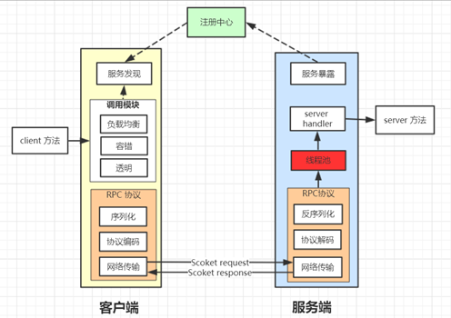

### 概述

一款轻量，高效的RPC框架，基于TCP的二进制通信协议实现

欢迎fork项目持续开发改进，性能优化

### 特征

- 基于netty的主从Reactor模型，NIO通信
- 支持同步，异步，携带回调等调用方式
- 支持spring项目下引入starter包开箱即用，整合spring，实现服务接口透明使用
- 支持非spring项目下单独使用，可不依赖spring环境
- 支持多种序列化类型，Protostuff，Kryo，Json，Jdk等
- 支持多种压缩算法，Snappy，Lz4，gzip，bzip2，Deflate，Lzo等
- 支持注册中心，自动服务注册和发现，默认实现zookpeer，也可不使用注册中心，手动指定服务端节点地址列表
- 支持多种负载均衡策略，随机，轮询，一致性hash等
- 支持服务容错，连接/调用异常情况下自动排除服务端故障节点
- 支持SPI扩展点，可扩展负载均衡策略，压缩算法，序列化类型，线程池，注册中心等
- 支持TLS双向认证加密
- 支持流量整形，请求异常重试，服务端请求去重等功能

### 设计



- **RPC协议**


- **同步线程模型**


- **异步线程模型**


### 使用示例

#### **一、spring环境下**

maven依赖

项目目前暂时还未上传到maven中央仓库，需clone项目到本地maven选择srpc(root)下install后使用

```xml
<dependency>
    <groupId>com.hex</groupId>
    <artifactId>srpc-spring-boot-starter</artifactId>
    <version>1.1.0</version>
</dependency>
```

若需使用zookeeper作为注册中心则引入

```xml
<dependency>
    <groupId>com.hex</groupId>
    <artifactId>srpc-registry-zookeeper</artifactId>
    <version>1.1.0</version>
</dependency>
```

**server端使用**

1.定义服务接口

```java
@SRpcClient(serviceName = "testService")
public interface HelloService {
    
    String hello(String name);
}
```

接口添加@SRpcClient注解，serviceName属性为rpc服务都在注册中心的服务名称，若不使用注册中心，则注解nodes属性需手动指定服务端节点集群地址，将根据负载均衡策略自动选取节点调用，配置优先级:serviceName > nodes

```java
@SRpcClient(nodes = "127.0.0.1:9955;127.0.0.1:9956;127.0.0.1:9957")
public interface HelloService {
    
    String hello(String name);
}
```

nodes属性有两种配置方式：
- 直接指定节点地址列表，以分号隔开的字符串，例如 @SRpcClient(nodes = "127.0.0.1:9955;127.0.0.1:9956;127.0.0.1:9957")
- 以$符号开头支持从yml或properties配置文件获取节点配置，例如 @SRpcClient(nodes = "${srpc.helloService}") 方式，需保证服务消费方的yml或properties配置文件有对应的集群地址配置，同样以分号隔开


2.服务接口实现

```java
@SRpcRoute
public class HelloServiceImpl implements HelloService {
    @Override
    public String hello(String name) {
        return name + " Hey bro, it's a good day";
    }
}
```

实现类添加@SRpcRoute注解，便会自动注册为spring的单例bean，可视为等同@Comphonent使用，内部可用@Autowired等spring相关注解，也可被其他bean注入。

3.配置yml

因同时包含了rpc客户端和服务端，所以客户端和服务端都需要配置，如需个性化配置的地方在yml或properties文件按需配置即可，以srpc.server或srpc.client为前缀。所有可自由配置的选项如下

服务端默认配置：

```java
@ConfigurationProperties(prefix = "srpc.server")
public class RpcServerProperties {
    private Integer port = 9957; //绑定端口
    private Integer businessThreads = 200; //业务处理线程池大小，0为不设置
    private Integer businessQueueSize = 500; //业务线程池队列大小
    private Integer connectionIdleTime = 180;//超过连接空闲时间(秒)未收发数据则关闭连接
    private Integer printConnectionNumInterval = 0; //打印服务端当前连接详情, 时间间隔(秒), 0为不打印
    private Boolean isPrintHearBeatPacketInfo = false; //是否打印心跳包信息

    private CompressType compressType = CompressType.SNAPPY; //压缩算法类型，无需压缩为NONE
    private SerializeType serializeType = SerializeType.PROTOSTUFF; //序列化类型，默认protostuff

    private Integer sendBuf = 65535; //tcp发送缓冲区
    private Integer receiveBuf = 65535; //tcp接收缓冲区
    private Integer lowWaterLevel = 1024 * 1024; //netty低水位
    private Integer highWaterLevel = 10 * 1024 * 1024; //netty高水位

    private boolean deDuplicateEnable = false; //是否开启去重处理
    private Integer duplicateCheckTime = 10; //请求去重缓存时长(秒)
    private Long duplicateMaxSize = 1024 * 64L; //最大缓存请求个数

    private Boolean trafficMonitorEnable = false; //是否开启流控
    private Long maxReadSpeed = 10 * 1000 * 1000L; //带宽限制，最大读取速度
    private Long maxWriteSpeed = 10 * 1000 * 1000L; //带宽限制，最大写出速度
    
    // ----tls加密部分配置
    private Boolean useTLS = false; //是否开启tls加密
    private String keyPath; //私钥文件路径
    private String keyPwd; //密码
    private String certPath; //证书文件路径
    private String trustCertPath; //受信任ca证书路径
    private String clientAuth; //是否要求客户端认证
    // ----注册中心配置部分
    private Boolean enableRegistry = false; //是否使用注册中心
    private String registrySchema; //注册中心模式名称
    private List<String> registryAddress; //注册中心地址
```

客户端默认配置：

```java
@ConfigurationProperties(prefix = "srpc.client")
public class RpcClientProperties {
    private Integer callBackTaskThreads = 200; //回调任务处理线程池大小，0为不设置
    private Integer callBackTaskQueueSize = 500; //回调任务线程池队列大小
    private Integer connectionTimeout = 5; //连接超时时间(秒)
    private Integer requestTimeout = 10; //请求超时时间(秒)
    private Integer connectionSizePerNode = 3; //每个节点连接数
    private Integer connectionIdleTime = 180; //超过连接空闲时间(秒)未收发数据则关闭连接
    private Integer heartBeatTimeInterval = 30; //发送心跳包间隔时间(秒)

    private CompressType compressType = CompressType.SNAPPY; //压缩算法类型，无需压缩为NONE
    private SerializeType serializeType = SerializeType.PROTOSTUFF; //序列化类型，默认protostuff

    private LoadBalanceRule loadBalanceRule = LoadBalanceRule.RANDOM; //集群负载均衡策略
    private boolean excludeUnAvailableNodesEnable = true; //集群模式下是否排除不可用的节点
    private Integer nodeErrorTimes = 3; //节点连接或请求超时/异常超过设置次数则置为节点不可用
    private Integer nodeHealthCheckTimeInterval = 10; //节点健康检查周期(秒),心跳包响应成功则恢复不可用的节点
    
    private Integer sendBuf = 65535; //tcp发送缓冲区
    private Integer receiveBuf = 65535; //tcp接收缓冲区
    private Integer lowWaterLevel = 1024 * 1024; //netty低水位
    private Integer highWaterLevel = 10 * 1024 * 1024; //netty高水位

    private Boolean trafficMonitorEnable = false; //是否开启流量控制
    private Long maxReadSpeed = 10 * 1000 * 1000L; //带宽限制，最大读取速度
    private Long maxWriteSpeed = 10 * 1000 * 1000L; //带宽限制，最大写出速度
    
    // ----TLS加密部分配置
    private Boolean useTLS = false; //是否开启TLS加密
    private String keyPath; //私钥文件路径
    private String keyPwd; //密码
    private String certPath; //证书文件路径
    private String trustCertPath; //受信任ca证书路径
    private String clientAuth; //是否要求客户端认证
    // ----注册中心配置部分
    private Boolean enableRegistry = false; //是否使用注册中心
    private String registrySchema; //注册中心模式名称, 缺省为zookeeper
    private List<String> registryAddress; //注册中心地址
```

配置类信息：
https://github.com/wosn00/srpc/blob/master/srpc-spring-boot-starter/src/main/java/com/hex/rpc/spring/starter/properties/RpcClientProperties.java

4.服务端启动

```java
@SpringBootApplication
@EnableSRpc(basePackages = "com.hex.example.provider")
public class RpcTestApplication {
    public static void main(String[] args) {
        SpringApplication.run(RpcTestApplication.class, args);
    }
}
```

启动类上添加@EnableSRpc注解，basePackages为需要扫描的包路径，包含@SRpcClient和@SRpcRoute注解的包路径，相应的类都会被自动注册为spring的单例bean，缺省为启动类上级包路径

**client端使用**

1.服务接口调用

```java
@Component
public class HelloRpcTest {
    
    @Autowired
    private HelloService helloService; // 上面定义的rpc服务接口

    public void rpcServerTest(String name) {
        String msg = helloService.hello(name);
        System.out.println(msg);
    }
}
```

上述服务端定义的带有@SRpcClient注解的rpc服务接口，使用spring的@Autowired注入即可远程调用

2.配置yml（同上）

3.客户端启动（同上）


#### 二、非spring环境下

maven依赖

```xml
<dependency>
    <groupId>com.hex</groupId>
    <artifactId>srpc-core</artifactId>
    <version>1.1.0</version>
</dependency>
```

若需使用zookeeper作为注册中心则引入

```xml
<dependency>
    <groupId>com.hex</groupId>
    <artifactId>srpc-registry-zookeeper</artifactId>
    <version>1.1.0</version>
</dependency>
```

**server端使用**

1.定义服务接口实现

```java
@SRpcRoute
public class HelloServiceImpl {
    @Mapping("hello")
    public String hello(String name) {
        return name + " Hey bro, it's a good day";
    }
}
```

2.服务端启动

```java
@SRpcScan("com.hex.example")
public class ServerTest {
    public static void main(String[] args) {
        // 启动服务端, 需填入rpc服务端配置, 可使用默认配置, source填写有@RouteScan注解的类
        SRpcServer.builder()
                .serverConfig(new SRpcServerConfig()) //包含rpc服务端的各项默认配置，可自行修改
                .sourceClass(ServerTest.class) //有@RouteScan注解的类
                .port(8005) //rpc服务端绑定的端口，默认9957
                .start();
    }
}
```

启动类上添加@SRpcScan注解，值需填写包含@SRpcRoute注解的类的包路径，缺省为启动类的上级包路径，即可自动扫描

**client端使用**

1.客户端启动和服务接口调用

```java
public class ClientTest {
    public static void main(String[] args1) {
        // 初始化客户端，需填入rpc客户端配置，可使用默认配置
        Client rpcClient = SRpcClient.builder()
                .config(new SRpcClientConfig())
                .start();

        Object[] args = {"Jack"};
        HostAndPort node = HostAndPort.from("127.0.0.1:8005");
        // 同步发送请求，获取响应
        String response = rpcClient.invoke("hello", String.class, args, node);
        System.out.println(response);

        // 异步发送请求，发送完成即返回，不阻塞等待响应结果
        rpcClient.invokeAsync("hello",
                rpcResponse -> System.out.println("收到响应，开始执行回调方法" + rpcResponse), args, node);
    }
}
```

Client更多调用接口及参数可查看接口说明：

https://github.com/wosn00/srpc/blob/master/srpc-core/src/main/java/com/hex/srpc/core/rpc/Client.java 

### 性能测试

目前只是与dubbo进行了及其简单的性能测试对比0_0，后续有时间会进行更多的测试

测试代码：https://github.com/wosn00/THOC/blob/master/srpc-demo-provider/src/main/java/com/hex/srpc/SRpcProviderApplication.java 

条件：

1.测试相同接口模拟业务处理延迟30ms后返回

2.服务端业务处理线程池均为500

3.dubbo采用默认的dubbo协议和hessian2序列化，srpc使用protostuff序列化

| 并发调用线程数 | srpc（TPS） | dubbo（TPS） |
| -------------- | ----------- | ------------ |
| 100            | 2810        | 2800         |
| 200            | 5522        | 5480         |
| 300            | 7834        | 7100         |
| 400            | 9980        | 8420         |
| 500            | 11380       | 9700         |
